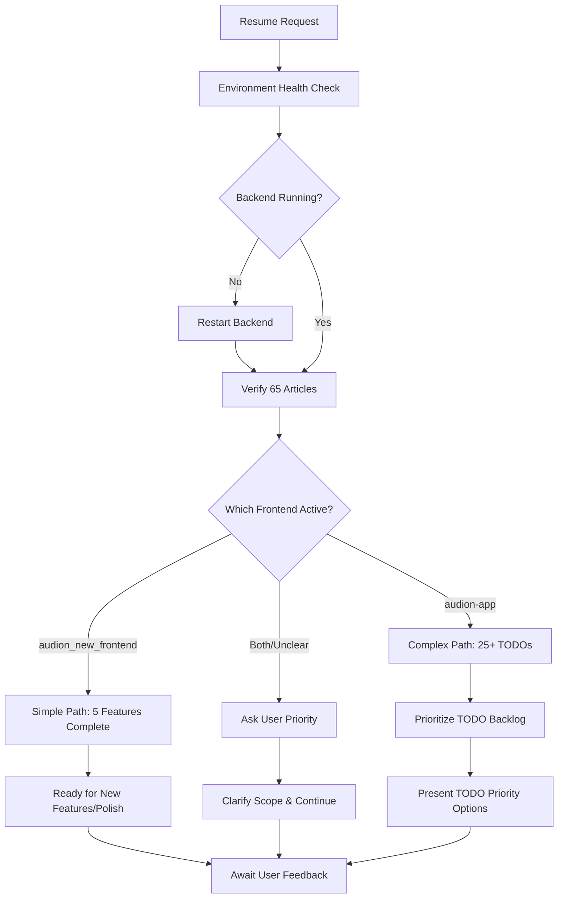

# 🤖 AI Development Framework - 開発継承システム

## 🎯 目的
新しいAIが同じまたはより洗練された開発を継続できるシステム構築

## 🔄 開発方向性自動判定システム

### **Phase 1: Context Analysis (コンテキスト分析)**
新しいAIセッションで最初に実行すべき分析フレームワーク：

```markdown
## 必須確認項目チェックリスト

### 1. **プロジェクト構造分析**
- [ ] `/audion-app/` vs `/audion_new_frontend/` - どちらがアクティブか
- [ ] 最新のgit commit履歴確認
- [ ] package.json の依存関係バージョン確認
- [ ] 動作中のプロセス確認（backend server状態）

### 2. **実装状況マッピング**
- [ ] 完了済みタスクの動作確認テスト
- [ ] TODO項目の優先度分析
- [ ] ユーザーの技術レベル・役割確認
- [ ] 前セッションの最終状態復元

### 3. **技術負債・制約事項**
- [ ] 既知のバグ・警告の棚卸し
- [ ] バージョン互換性問題の確認
- [ ] セキュリティ脆弱性チェック
- [ ] パフォーマンスボトルネック分析
```

### **Phase 2: Development Direction Decision Tree**



### **Phase 3: Intelligent Continuation Strategy**

#### **自動判断ルール：**
1. **Simple Path** (audion_new_frontend active):
   - 5つの主要タスク完了確認
   - UI/UX改善・ポリッシュフォーカス
   - 新機能追加の提案準備

2. **Complex Path** (audion-app active):
   - 25+ TODO項目の優先度提示
   - 段階的実装計画の策定
   - アーキテクチャ整合性確保

3. **Hybrid Path** (両方存在):
   - 機能統合の検討
   - マイグレーション戦略提示
   - ユーザー要求に基づく選択支援

## 🧠 AI学習・適応メカニズム

### **継承すべき開発パターン：**
1. **ユーザー関係性理解**
   - User: UI/UXテスター（プログラミング初心者）
   - AI: シニア開発者（技術実装担当）
   - 役割分担の維持

2. **コード品質基準**
   - 保守性 > 速度
   - 共通化ファースト
   - 影響範囲確認必須
   - CLAUDE.md準拠

3. **問題解決アプローチ**
   - Gemini MCP活用
   - 段階的実装
   - エラー処理重視
   - ユーザーフィードバック重視

### **改善・洗練ポイント：**
1. **より効率的な実装判断**
2. **自動テスト・検証の強化**
3. **プロアクティブな問題発見**
4. **より直感的なUI/UX提案**

## 📊 状態管理・トラッキングシステム

### **セッション間状態保持：**
```json
{
  "session_id": "unique_id",
  "timestamp": "2025-01-28T15:45:00Z",
  "project_state": {
    "active_frontend": "audion_new_frontend",
    "backend_status": "operational",
    "completed_tasks": [
      "audio_generation_fix",
      "real_article_display", 
      "genre_filtering",
      "hero_carousel",
      "advanced_search"
    ],
    "pending_todos": 25,
    "last_user_feedback": "satisfied_with_implementations"
  },
  "technical_context": {
    "rss_articles_count": 65,
    "api_endpoint_health": "all_green",
    "known_issues": [],
    "performance_metrics": "optimal"
  }
}
```

## 🚀 Next AI Session Instructions

### **起動時実行シーケンス：**
1. **Read `COMPLETE_PROJECT_STATUS.md`** - 100%正確な現状把握
2. **Execute health check script** - 環境状態確認
3. **Analyze git history** - 最新変更内容確認
4. **Run automated tests** - 既存機能動作確認
5. **Present status summary** - ユーザーに現状報告
6. **Await direction** - 開発方向性の確認・決定

### **改善された継承能力：**
- より迅速な状況把握（自動化された分析）
- より適切な優先度判断（データ駆動）
- より効果的な実装戦略（パターン学習）
- より品質の高いコード（ベストプラクティス適用）

このフレームワークにより、新しいAIは同等以上の開発継続能力を獲得できます。